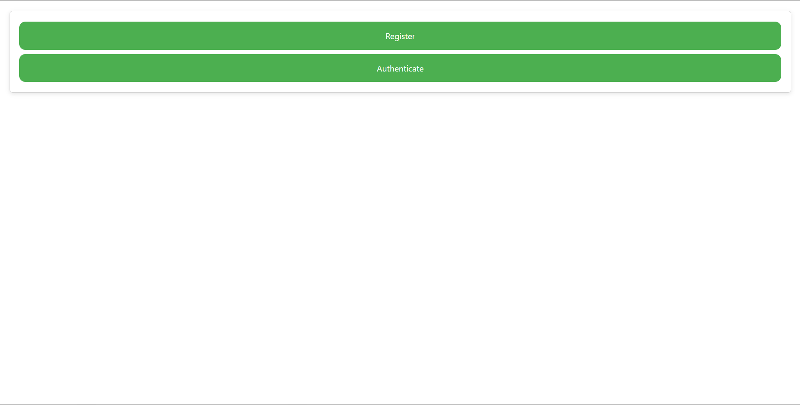
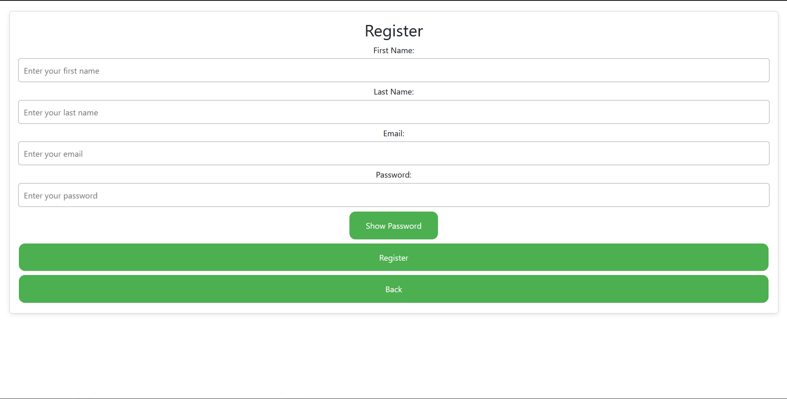
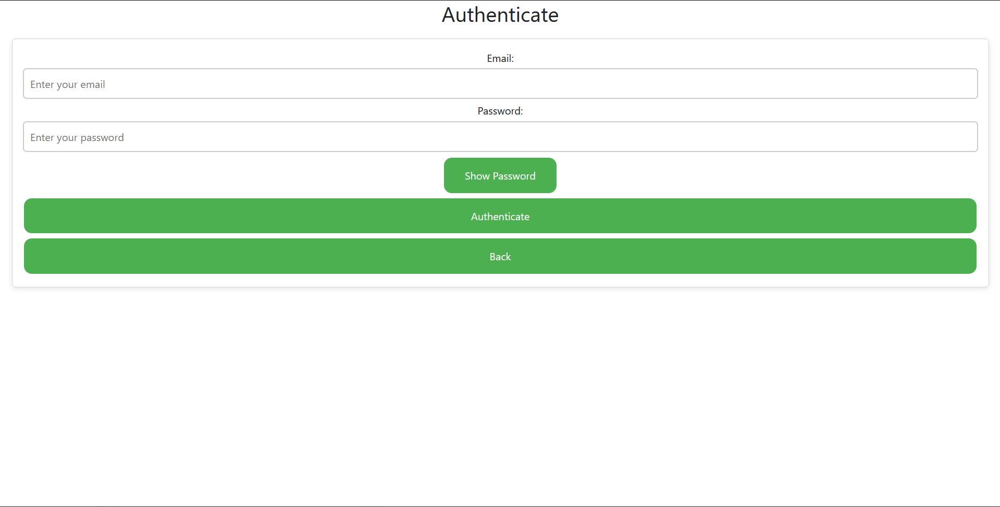
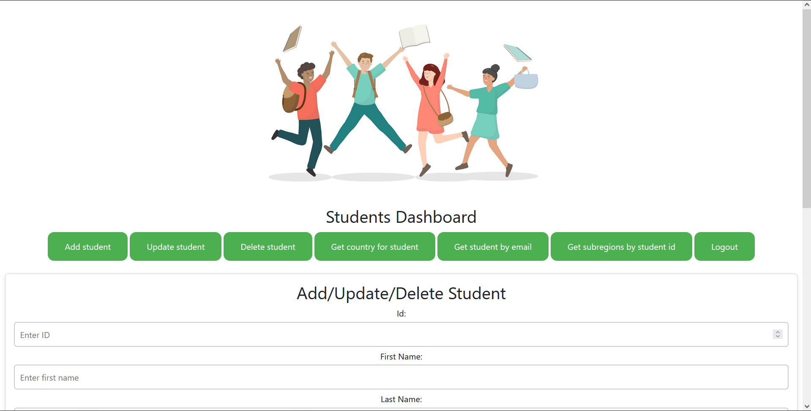
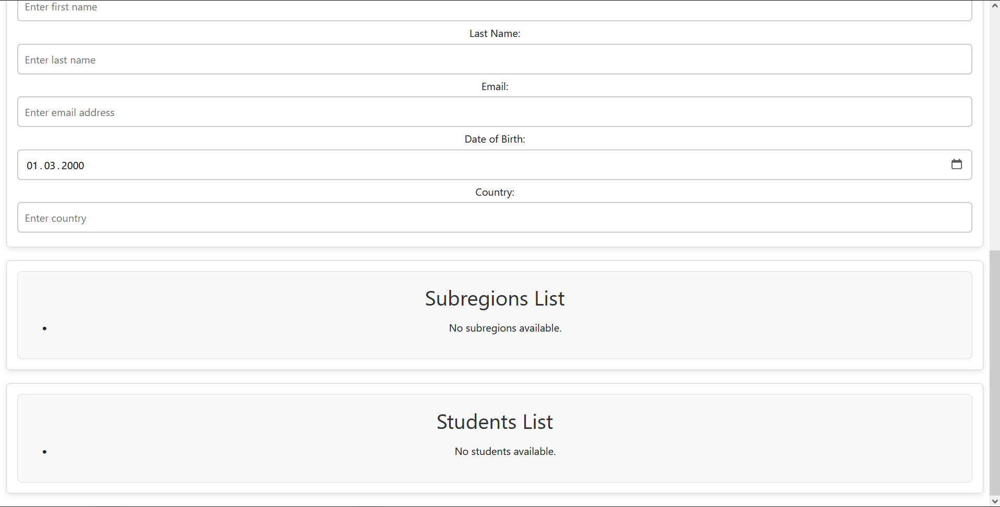

# Student App

A Spring-based application utilizing REST, DTOs, Spring Security (via JWT), React, and a PostgreSQL database.

## Table of Contents
- [General Information](#general-information)
- [Technologies Used](#technologies-used)
- [Features](#features)
- [Screenshots](#screenshots)
- [Setup](#setup)
- [Usage](#usage)
- [Project Status](#project-status)
- [Room for Improvement](#room-for-improvement)

## General Information
This project was developed to test and showcase the capabilities of Spring, Spring Security, and PostgreSQL, with a particular focus on JPA. OpenAPI is utilized to describe, consume, and visualize RESTful web services, while React handles the application's frontend interface.

## Technologies Used
- Java
- Spring Framework
- PostgreSQL
- Docker
- OpenAPI
- Spring Security
- React

## Features
- Add a student
- Delete a student
- Retrieve all students (with pagination)
- Update student information
- Fetch a student by email
- Validate date formats
- Email format verification
- Retrieve region and subregion data from an external API based on the student's country
- User registration
- User authentication

## Screenshots







## Setup
To run the application, you need to define the following global environment variables:
- `DATABASE_URL` (e.g., `jdbc:postgresql://localhost:5432`)
- `DATABASE_USERNAME`
- `DATABASE_PASSWORD`
- `DATABASE_NAME`
- `SECRET_KEY`

These credentials are essential for the application to function properly, and the secret key is vital for the app's security.
To start the application, build all JAR files and execute the following command:

```bash
   docker compose up --build
```

A JWT token is generated during user registration and is required for authentication. Ensure to register a user with a valid email.


The generated token will be used for requests or to authenticate users at the `authenticate` endpoint.

## Usage
It is recommended to use tools like Postman or OpenAPI for testing the available API endpoints. Here are some of the key endpoints:

- **Add Student**:
    - `POST http://localhost:8090/api/v1/student/addStudent`

- **Delete Student**:
    - `DELETE http://localhost:8090/api/v1/student/{{studentId}}`

- **Get All Students (Pagination)**:
    - `GET http://localhost:8090/api/v1/student`
    - Additional parameters: `offset`, `pageSize`, `sortBy`
      

- **Update Student**:
    - `PUT http://localhost:8090/api/v1/student/{{studentId}}`

- **Get Student by Email**:
    - `GET http://localhost:8090/api/v1/student/{{email}}`

- **Get Region and Subregion by Country**:
    - `GET http://localhost:8090/api/v1/student/regionsByCountry/{studentId}`

- **Access OpenAPI Documentation**:
    - `http://localhost:8090/swagger-ui/index.html`

## Project Status
The project is currently **complete**.

## Room for Improvement
Future enhancements could include a more polished user interface and additional features to further improve the user experience.