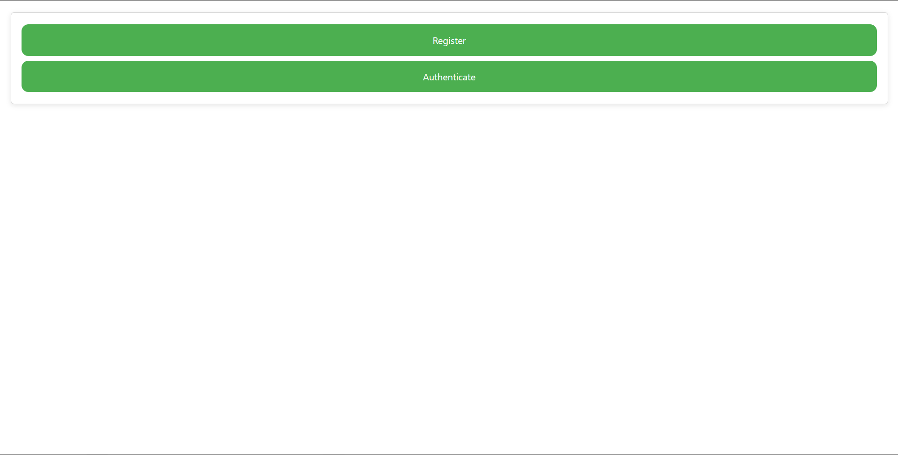
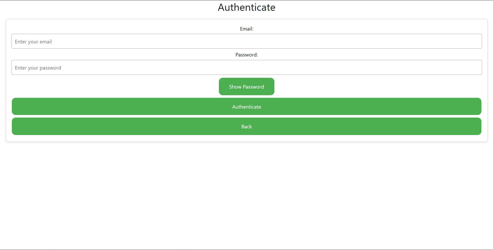

# Student App

A Spring-based application utilizing REST, DTOs, Spring Security (JWT), React, and PostgreSQL.

## Table of Contents
- [General Information](#general-information)
- [Technologies Used](#technologies-used)
- [Features](#features)
- [Screenshots](#screenshots)
- [Setup](#setup)
- [Usage](#usage)
- [Project Status](#project-status)
- [Room for Improvement](#room-for-improvement)

## General Information
This project demonstrates Spring, Spring Security, JPA with PostgreSQL, and a React frontend. OpenAPI (Swagger) is used to describe and visualize the REST API.

## Technologies Used
- Java / Spring Boot
- Spring Security (JWT)
- PostgreSQL
- Docker / Docker Compose
- OpenAPI / Swagger
- React

## Features
- Add, update, and delete students
- Retrieve students with pagination and sorting
- Fetch a student by email
- Date and email format validation
- Retrieve region/subregion data from an external API based on a student's country
- User registration and authentication (JWT)

## Screenshots






## Setup
Define the following environment variables before running the application (example values shown):

- `DATABASE_URL` — JDBC URL, e.g. `jdbc:postgresql://localhost:5432`
- `DATABASE_USERNAME` — e.g. `postgres`
- `DATABASE_PASSWORD` — e.g. `password`
- (Optional) `DATABASE_NAME` — if your configuration expects a separate name
- `SECRET_KEY` — secret used to sign JWTs

Ensure the database is accessible and credentials are correct.

To build and start the services (run from the repository root):
```bash
docker compose up --build
```

## Usage
Recommended tools: Postman or the OpenAPI/Swagger UI.

Common endpoints (default base: `http://localhost:8090`):

- **Add Student**:
    - `POST /api/v1/student/addStudent`

- **Delete Student**:
    - `DELETE /api/v1/student/{studentId}`

- **Get All Students (with pagination)**:
    - `GET /api/v1/student`
    - Query params: `offset`, `pageSize`, `sortBy`
      

- **Update Student**:
    - `PUT /api/v1/student/{studentId}`

- **Get Student by Email**:
    - `GET /api/v1/student/{email}`

- **Get Region and Subregion by Country**:
    - `GET /api/v1/student/regionsByCountry/{studentId}`

- **Authentication / Registration endpoints**:
    - Check your project's auth controller paths (register/authenticate)

- **OpenAPI / Swagger UI**:
    - `http://localhost:8090/swagger-ui/index.html`

## Project Status
The project is currently complete.

## Room for Improvement
- Improve UI polish and UX
- Add more automated tests and CI/CD