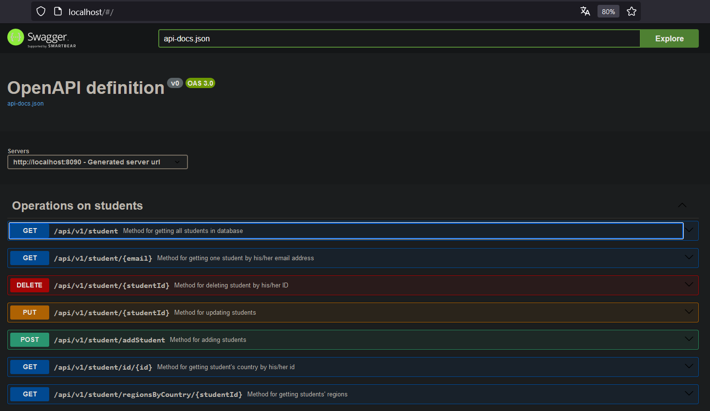
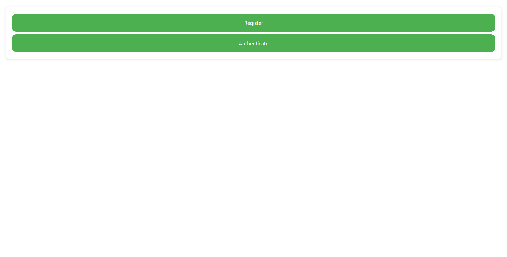
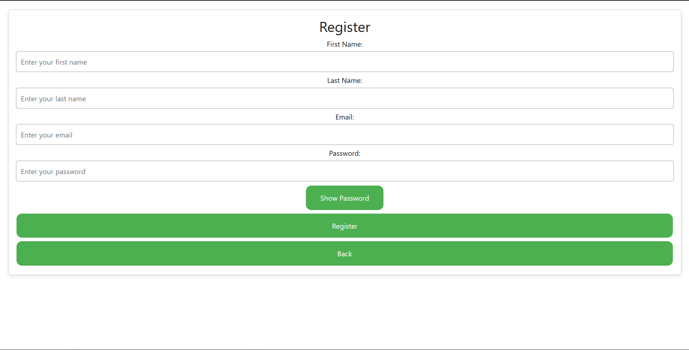
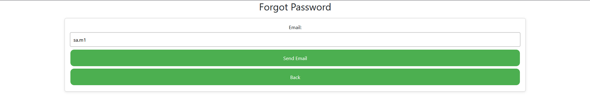
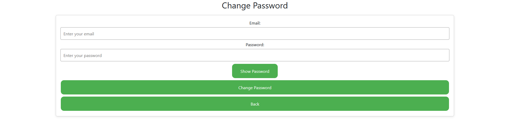
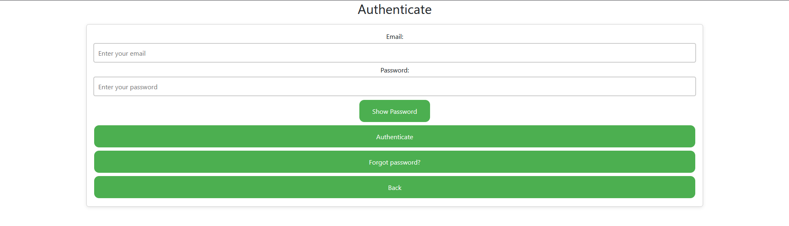
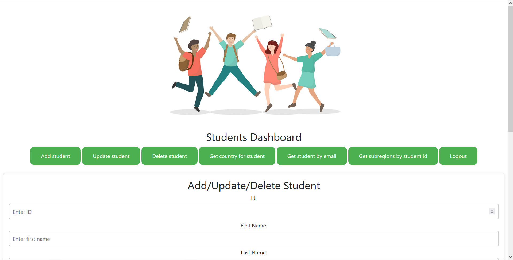
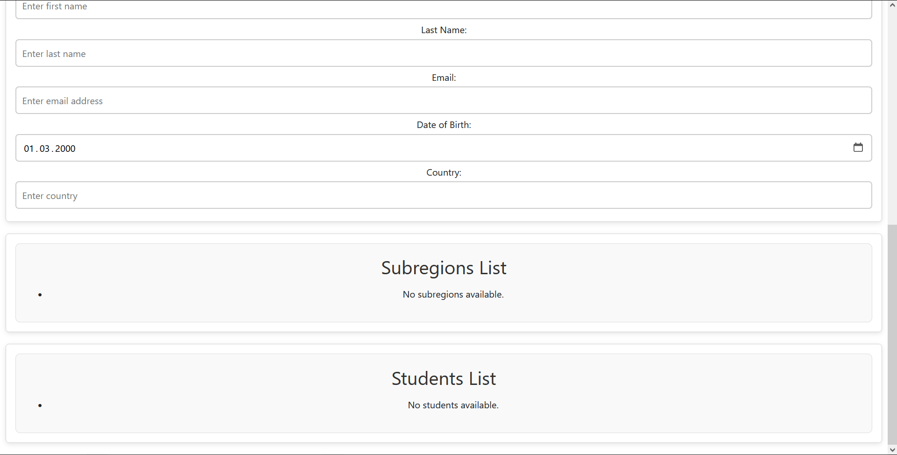
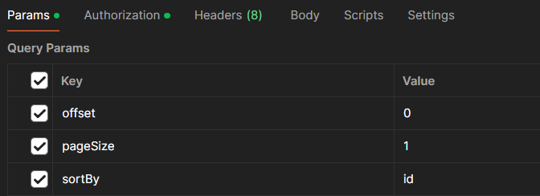

# Student App

A Spring-based application utilizing REST, DTOs, Spring Security (JWT), React, and PostgreSQL.

## Table of Contents

- [General Information](#general-information)
- [Technologies Used](#technologies-used)
- [Features](#features)
- [Screenshots](#screenshots)
- [Setup](#setup)
- [Usage](#usage)
- [Project Status](#project-status)
- [Room for Improvement](#room-for-improvement)

## General Information

This project demonstrates Spring, Spring Security, JPA with PostgreSQL, and a React frontend. OpenAPI (Swagger) is used
to describe and visualize the REST API.

## Technologies Used

- Java / Spring Boot
- Spring Security (JWT)
- PostgreSQL
- Docker / Docker Compose
- OpenAPI / Swagger
- React

## Features

- Add, update, and delete students
- Retrieve students with pagination and sorting
- Fetch a student by email
- Date and email format validation
- Retrieve region/subregion data from an external API based on a student's country
- User registration and authentication (JWT)
- Send forgot password emails via e.g. Brevo SMTP relay

## Screenshots










## Setup

Define the following environment variables in a `.env` file (you can use `.env.example` as a reference):

- `DATABASE_URL` — JDBC URL, e.g. `jdbc:postgresql://localhost:5432`
- `DATABASE_USERNAME` — e.g. `postgres`
- `DATABASE_PASSWORD` — e.g. `password`
- (Optional) `DATABASE_NAME` — if your configuration expects a separate name
- `SECRET_KEY` — secret used to sign JWTs
- `EMAIL_HOST` - e.g. `smtp-relay.brevo.com`
- `EMAIL_USERNAME` - e.g. `...@smtp-brevo.com`
- `EMAIL_PASSWORD` - e.g. `password`

Ensure the database is accessible and credentials are correct.

To build and start the services (run from the repository root):

```bash
docker compose --env-file .env up --build
```

## Usage

Recommended tools: Postman or the OpenAPI/Swagger UI.

Common endpoints (default base: `http://localhost:8090`):

- **Add Student**:
    - `POST /api/v1/student/addStudent`

- **Delete Student**:
    - `DELETE /api/v1/student/{studentId}`

- **Get All Students (with pagination)**:
    - `GET /api/v1/student`
    - Query params: `offset`, `pageSize`, `sortBy`
      

- **Update Student**:
    - `PUT /api/v1/student/{studentId}`

- **Get Student by Email**:
    - `GET /api/v1/student/{email}`

- **Get Region and Subregion by Country**:
    - `GET /api/v1/student/regionsByCountry/{studentId}`

- **Authentication / Registration / Change password endpoints**:
    - `POST /api/v1/auth/register"`
    - `POST /api/v1/auth/authenticate"`
    - `POST /api/v1/auth/forgot-password"`
    - `POST /api/v1/auth/reset-password"`

- **OpenAPI / Swagger UI**:
    - `http://localhost:8090/swagger-ui/index.html`

## Project Status

The project is currently complete.

## Room for Improvement

- Improve UI polish and UX
- Add more automated tests and CI/CD
